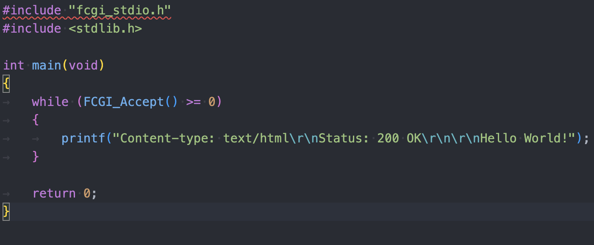
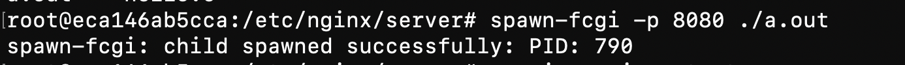
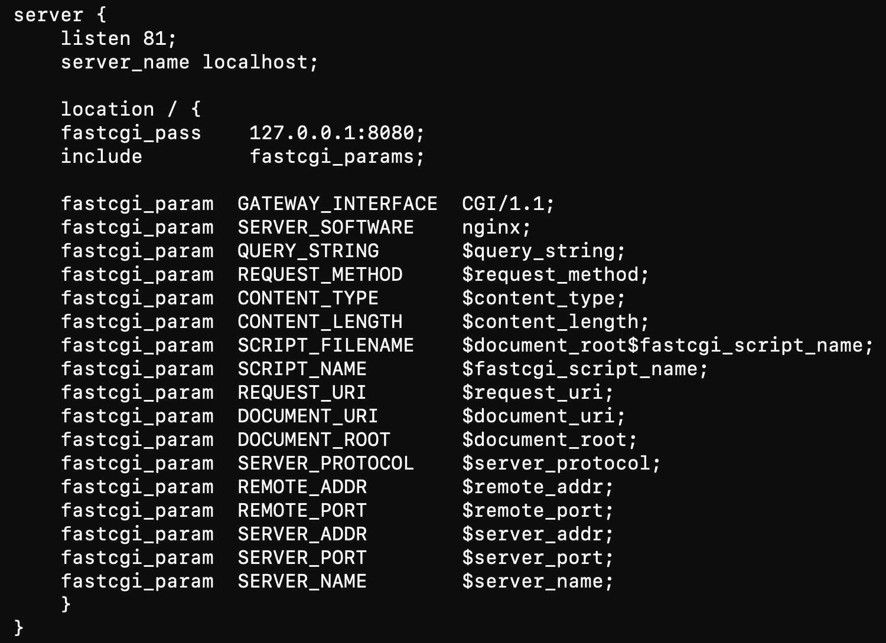
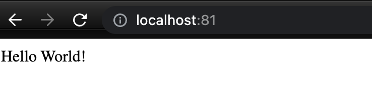

## Part III. Мини веб-сервер

- Написать мини сервер на C и FastCgi, который будет возвращать простейшую страничку с надписью Hello World!

- Запустить написанный мини сервер через spawn-fcgi на порту 8080

- Написать свой nginx.conf, который будет проксировать все запросы с 81 порта на 127.0.0.1:8080

- Проверить, что в браузере по localhost:81 отдается написанная вами страничка

